# Quorum-MCP Server

> Production-ready Multi-AI Consensus System with Web UI, Rate Limiting, Budget Controls, and Performance Benchmarking

[](https://github.com/aj-geddes/quorum-mcp)
[](https://github.com/aj-geddes/quorum-mcp)
[](https://www.python.org)
[](LICENSE)

## Overview

Quorum-MCP Server is a production-ready web service that orchestrates multiple AI providers through multi-round deliberation to produce consensus-based responses. It features a modern web UI, real-time WebSocket updates, comprehensive rate limiting, budget controls, and performance benchmarking.


## Features

### 🎯 Core Capabilities

- **Multi-Provider Consensus**: Orchestrates 5+ AI providers (Anthropic, OpenAI, Google, Mistral, Ollama)
- **Three Deliberation Modes**: Quick consensus, full deliberation, or devil's advocate
- **Production Web UI**: Modern responsive interface with real-time updates
- **WebSocket Support**: Live updates for long-running consensus operations
- **Session Management**: Track and retrieve consensus sessions with full history

### 🛡️ Production Controls

- **Rate Limiting**: Token-bucket algorithm per provider (request + token limits)
- **Budget Management**: Multi-period budgets (hourly/daily/weekly/monthly/total) with alerts
- **Performance Benchmarking**: Track latency, throughput, cost efficiency, success rates
- **Health Monitoring**: Real-time provider health checks and status dashboard

### 🚀 Deployment

- **Kubernetes-Ready**: Full K8s manifests with ingress, services, and configmaps
- **Docker Container**: Multi-stage build with security best practices
- **Environment Config**: Flexible configuration via environment variables and secrets
- **Horizontal Scaling**: StatefulSet-compatible with 2+ replicas

## Quick Start

### Local Development

```bash
# Clone repository
git clone https://github.com/yourusername/quorum-mcp.git
cd quorum-mcp

# Install dependencies
pip install -e .

# Set environment variables
export ANTHROPIC_API_KEY="sk-ant-..."
export OPENAI_API_KEY="sk-..."
export GOOGLE_API_KEY="..."
export MISTRAL_API_KEY="..."

# Start server
python -m uvicorn quorum_mcp.web.app:app --host 0.0.0.0 --port 8000
```

### Kubernetes Deployment

```bash
# Configure your API keys
cp k8s/secret.yaml.template k8s/secret.yaml
# Edit k8s/secret.yaml with your actual API keys

# Deploy to cluster
chmod +x k8s/deploy.sh
./k8s/deploy.sh

# Add to /etc/hosts
echo "127.0.0.1 quorum-mcp.local" | sudo tee -a /etc/hosts

# Access Web UI
open http://quorum-mcp.local
```

## Architecture

### System Flow

```mermaid
sequenceDiagram
    participant User
    participant WebUI
    participant API
    participant Orchestrator
    participant RateLimiter
    participant BudgetMgr
    participant Provider1
    participant Provider2
    participant Provider3
    participant Benchmark

    User->>WebUI: Submit Query
    WebUI->>API: POST /api/query
    API->>Orchestrator: execute_quorum(query, mode)

    Orchestrator->>RateLimiter: Check rate limits
    RateLimiter-->>Orchestrator: ✓ Allowed

    Orchestrator->>BudgetMgr: Check budget
    BudgetMgr-->>Orchestrator: ✓ Within budget

    par Parallel Provider Calls
        Orchestrator->>Provider1: send_request()
        Orchestrator->>Provider2: send_request()
        Orchestrator->>Provider3: send_request()
    end

    Provider1-->>Orchestrator: Response A
    Provider2-->>Orchestrator: Response B
    Provider3-->>Orchestrator: Response C

    Orchestrator->>Orchestrator: Calculate consensus

    Orchestrator->>BudgetMgr: Record costs
    Orchestrator->>Benchmark: Record metrics

    Orchestrator-->>API: ConsensusResult
    API-->>WebUI: JSON Response
    WebUI-->>User: Display Result

    loop Real-time Updates
        API->>WebUI: WebSocket: Progress
    end
```



### Consensus Building Process


### Rate Limiting System

```mermaid
graph LR
    subgraph "Provider Rate Limiter"
        direction TB
        RB1[Request Bucket<br/>Capacity: 60 RPM<br/>Refill: 1/sec]
        TB1[Token Bucket<br/>Capacity: 100K TPM<br/>Refill: 1667/sec]
    end

    subgraph "Provider Rate Limiter Manager"
        direction TB
        Anthropic[Anthropic Limiter]
        OpenAI[OpenAI Limiter]
        Google[Google Limiter]
        Mistral[Mistral Limiter]
        Ollama[Ollama Limiter]
    end

    Request[Incoming Request] --> RB1
    RB1 -->|Check| TB1
    TB1 -->|Acquire| Allow[✓ Allow Request]
    TB1 -->|Reject| Deny[✗ Rate Limited]

    Anthropic --> RB1
    OpenAI --> RB1
    Google --> RB1
    Mistral --> RB1
    Ollama --> RB1

    style Allow fill:#4CAF50
    style Deny fill:#F44336
```



### Budget Management


### Performance Benchmarking


## API Reference

### Health Check

```bash
GET /api/health
```

```json
{
  "status": "healthy",
  "providers": 5,
  "session_manager": "running"
}
```

### Submit Query

```bash
POST /api/query
Content-Type: application/json

{
  "query": "What are the best practices for API design?",
  "mode": "quick_consensus",
  "providers": ["anthropic", "openai", "google"]
}
```

```json
{
  "session_id": "abc123",
  "consensus": "REST APIs should follow...",
  "confidence": 0.92,
  "provider_responses": [...],
  "total_cost": 0.0234,
  "duration": 3.45
}
```

### Get Session

```bash
GET /api/session/{session_id}
```

### List Sessions

```bash
GET /api/sessions?limit=10&status=completed
```

### Provider Status

```bash
GET /api/providers
```

```json
{
  "providers": [
    {
      "name": "anthropic",
      "status": "healthy",
      "response_time": 0.85,
      "rate_limit": {
        "requests_available": 58,
        "tokens_available": 95234
      }
    }
  ]
}
```

### Rate Limit Status

```bash
GET /api/rate-limits
```

```json
{
  "anthropic": {
    "requests_per_minute": 60,
    "tokens_per_minute": 100000,
    "requests_available": 58,
    "tokens_available": 95234
  }
}
```

### Budget Status

```bash
GET /api/budget
```

```json
{
  "budgets": [
    {
      "period": "daily",
      "limit": 10.0,
      "spent": 2.34,
      "remaining": 7.66,
      "percentage": 23.4
    }
  ],
  "global": {
    "total_spent": 45.67,
    "providers": {
      "anthropic": 12.34,
      "openai": 23.45,
      "google": 9.88
    }
  }
}
```

### Set Budget

```bash
POST /api/budget
Content-Type: application/json

{
  "period": "daily",
  "limit": 10.0,
  "provider": null,
  "alert_threshold": 0.8,
  "enforce": true
}
```

### Budget Alerts

```bash
GET /api/budget/alerts
```

```json
{
  "alerts": [
    {
      "timestamp": "2025-01-06T16:54:10Z",
      "period": "daily",
      "provider": null,
      "percentage": 85.2,
      "spent": 8.52,
      "limit": 10.0,
      "message": "Daily budget at 85.2%"
    }
  ]
}
```

### Performance Summary

```bash
GET /api/benchmark/summary?time_window=24h
```

```json
{
  "window": "24h",
  "total_requests": 1234,
  "total_cost": 45.67,
  "avg_latency": 1.23,
  "success_rate": 0.98,
  "providers": {
    "anthropic": {
      "requests": 456,
      "avg_latency": 1.15,
      "success_rate": 0.99
    }
  }
}
```

### Provider Benchmarks

```bash
GET /api/benchmark/providers?providers=anthropic,openai,google&time_window=24h
```

```json
{
  "comparison": [
    {
      "provider": "anthropic",
      "model": "claude-3-5-sonnet-20241022",
      "avg_latency": 1.15,
      "p95_latency": 2.34,
      "p99_latency": 3.45,
      "avg_throughput": 87.5,
      "cost_per_1k_tokens": 0.0031,
      "success_rate": 0.99
    }
  ]
}
```

### Leaderboard

```bash
GET /api/benchmark/leaderboard/latency?time_window=24h&limit=10
```

```json
{
  "metric": "latency",
  "window": "24h",
  "leaderboard": [
    {
      "rank": 1,
      "provider": "google",
      "model": "gemini-2.5-flash",
      "value": 0.45,
      "unit": "seconds"
    }
  ]
}
```

### WebSocket Connection

```javascript
const ws = new WebSocket('ws://quorum-mcp.local/ws');

ws.onmessage = (event) => {
  const data = JSON.parse(event.data);
  console.log('Status update:', data);
};
```

## Web UI

The Quorum-MCP server includes a modern web interface accessible at `http://quorum-mcp.local` (or your configured domain).

### UI Structure


### Query Tab

- **Query Input**: Multi-line text area for entering queries
- **Mode Selection**: Choose between quick consensus, full deliberation, or devil's advocate
- **Provider Selection**: Select which providers to include (default: all available)
- **Submit Button**: Executes the query and displays results
- **Results Display**: Shows consensus, confidence score, individual provider responses, cost, and duration

### Providers Tab

- **Health Cards**: Real-time health status for each provider
- **Response Time**: Average response time over last 100 requests
- **Status Indicators**: Color-coded status (green=healthy, yellow=degraded, red=unhealthy)
- **Model Info**: Current model being used for each provider

### Sessions Tab

- **Session List**: Recent sessions with timestamps, status, and cost
- **Search/Filter**: Filter by status, date range, or query text
- **Session Details**: Click to view full session details including all rounds
- **Export**: Download session data as JSON

### Budget Tab

- **Budget Bars**: Visual representation of budget utilization by period
- **Set Budget Form**: Configure new budgets with period, limit, and threshold
- **Alert Notifications**: Real-time budget alerts when thresholds are exceeded
- **Cost Breakdown**: Pie chart showing cost distribution by provider

### Performance Tab

- **Summary Cards**: Total requests, success rate, average latency, total cost
- **Provider Comparison Table**: Side-by-side metrics for all providers
- **Latency Chart**: Bar chart comparing P50/P95/P99 latencies
- **Cost Efficiency Chart**: Bar chart showing cost per 1K tokens
- **Time Window Selector**: Choose 1h, 24h, 7d, or all-time metrics

## Configuration

### Environment Variables

#### Provider API Keys

```bash
ANTHROPIC_API_KEY=sk-ant-...
OPENAI_API_KEY=sk-...
GOOGLE_API_KEY=...
MISTRAL_API_KEY=...
```

#### Ollama Configuration

```bash
OLLAMA_HOST=http://ollama.ollama.svc.cluster.local:11434
OLLAMA_ENABLE=true
```

#### Application Settings

```bash
LOG_LEVEL=INFO
SESSION_TIMEOUT_HOURS=24
MAX_CONCURRENT_REQUESTS=10
```

#### Rate Limiting Defaults

```bash
DEFAULT_REQUESTS_PER_MINUTE=60
DEFAULT_TOKENS_PER_MINUTE=100000
```

#### Budget Defaults

```bash
DEFAULT_BUDGET_LIMIT=10.00
DEFAULT_BUDGET_PERIOD=daily
```

### Kubernetes ConfigMap

```yaml
apiVersion: v1
kind: ConfigMap
metadata:
  name: quorum-mcp-config
  namespace: quorum-mcp
data:
  OLLAMA_HOST: "http://ollama.ollama.svc.cluster.local:11434"
  OLLAMA_ENABLE: "true"
  LOG_LEVEL: "INFO"
  SESSION_TIMEOUT_HOURS: "24"
  MAX_CONCURRENT_REQUESTS: "10"
  DEFAULT_REQUESTS_PER_MINUTE: "60"
  DEFAULT_TOKENS_PER_MINUTE: "100000"
  DEFAULT_BUDGET_LIMIT: "10.00"
  DEFAULT_BUDGET_PERIOD: "daily"
```

### Kubernetes Secrets

```bash
# Create secrets from command line
kubectl create secret generic quorum-mcp-secrets \
  --namespace=quorum-mcp \
  --from-literal=ANTHROPIC_API_KEY='sk-ant-...' \
  --from-literal=OPENAI_API_KEY='sk-...' \
  --from-literal=GOOGLE_API_KEY='...' \
  --from-literal=MISTRAL_API_KEY='...'
```

## Kubernetes Deployment

### Architecture


### Deployment Resources

```yaml
# Namespace
apiVersion: v1
kind: Namespace
metadata:
  name: quorum-mcp

---
# Deployment
apiVersion: apps/v1
kind: Deployment
metadata:
  name: quorum-mcp
  namespace: quorum-mcp
spec:
  replicas: 2
  selector:
    matchLabels:
      app: quorum-mcp
  template:
    metadata:
      labels:
        app: quorum-mcp
    spec:
      containers:
      - name: quorum-mcp
        image: quorum-mcp:latest
        ports:
        - containerPort: 8000
        resources:
          requests:
            cpu: "500m"
            memory: "512Mi"
          limits:
            cpu: "2000m"
            memory: "2Gi"
        livenessProbe:
          httpGet:
            path: /api/health
            port: 8000
          initialDelaySeconds: 30
          periodSeconds: 10
        readinessProbe:
          httpGet:
            path: /api/health
            port: 8000
          initialDelaySeconds: 5
          periodSeconds: 5

---
# Service
apiVersion: v1
kind: Service
metadata:
  name: quorum-mcp
  namespace: quorum-mcp
spec:
  type: ClusterIP
  ports:
  - port: 80
    targetPort: 8000
  selector:
    app: quorum-mcp
  sessionAffinity: ClientIP

---
# Ingress
apiVersion: networking.k8s.io/v1
kind: Ingress
metadata:
  name: quorum-mcp
  namespace: quorum-mcp
  annotations:
    nginx.ingress.kubernetes.io/websocket-services: quorum-mcp
spec:
  ingressClassName: nginx
  rules:
  - host: quorum-mcp.local
    http:
      paths:
      - path: /
        pathType: Prefix
        backend:
          service:
            name: quorum-mcp
            port:
              number: 80
```

### Deployment Steps

1. **Build Docker Image**
   ```bash
   docker build -t quorum-mcp:latest .
   ```

2. **Import to k3d (if using k3d)**
   ```bash
   k3d image import quorum-mcp:latest -c your-cluster-name
   ```

3. **Create Secrets**
   ```bash
   cp k8s/secret.yaml.template k8s/secret.yaml
   # Edit k8s/secret.yaml with your API keys
   ```

4. **Deploy**
   ```bash
   chmod +x k8s/deploy.sh
   ./k8s/deploy.sh
   ```

5. **Add to /etc/hosts**
   ```bash
   echo "127.0.0.1 quorum-mcp.local" | sudo tee -a /etc/hosts
   ```

6. **Access Web UI**
   ```bash
   open http://quorum-mcp.local
   ```

### Verify Deployment

```bash
# Check pods
kubectl get pods -n quorum-mcp

# Check service
kubectl get svc -n quorum-mcp

# Check ingress
kubectl get ingress -n quorum-mcp

# View logs
kubectl logs -f -n quorum-mcp -l app=quorum-mcp

# Test health endpoint
curl http://quorum-mcp.local/api/health
```

### Scaling

```bash
# Scale to 3 replicas
kubectl scale deployment/quorum-mcp --replicas=3 -n quorum-mcp

# Auto-scaling (optional)
kubectl autoscale deployment/quorum-mcp \
  --cpu-percent=70 \
  --min=2 \
  --max=10 \
  -n quorum-mcp
```

## Troubleshooting

### Pods Not Starting

```bash
# Check pod events
kubectl describe pod -n quorum-mcp -l app=quorum-mcp

# Check logs
kubectl logs -n quorum-mcp -l app=quorum-mcp

# Common issues:
# - Missing API keys in secrets
# - Insufficient resources
# - Image pull errors (k3d: need to import image)
```

### Can't Access Web UI

```bash
# Check ingress controller
kubectl get pods -n ingress-nginx

# Check ingress configuration
kubectl describe ingress quorum-mcp -n quorum-mcp

# Verify /etc/hosts entry
cat /etc/hosts | grep quorum-mcp

# Test direct service access
kubectl port-forward -n quorum-mcp svc/quorum-mcp 8000:80
# Then visit http://localhost:8000
```

### Provider Failures

```bash
# Check provider status
curl http://quorum-mcp.local/api/providers

# View logs for specific errors
kubectl logs -n quorum-mcp -l app=quorum-mcp --tail=100

# Common issues:
# - Invalid API keys
# - Rate limits exceeded
# - Network connectivity issues
# - Ollama not running (if using Ollama)
```

### Rate Limiting Issues

```bash
# Check rate limit status
curl http://quorum-mcp.local/api/rate-limits

# Adjust rate limits in code or via environment variables
# Default: 60 RPM, 100K TPM per provider
```

### Budget Exceeded

```bash
# Check budget status
curl http://quorum-mcp.local/api/budget

# Check budget alerts
curl http://quorum-mcp.local/api/budget/alerts

# Adjust budget limits
curl -X POST http://quorum-mcp.local/api/budget \
  -H "Content-Type: application/json" \
  -d '{"period": "daily", "limit": 20.0}'
```

## Performance Tuning

### Optimize for Latency

- Use faster providers (Google Gemini Flash, Anthropic Haiku)
- Reduce `max_tokens` in requests
- Use `quick_consensus` mode
- Increase concurrent requests per provider

### Optimize for Cost

- Use cheaper models (GPT-4o-mini, Gemini Flash)
- Reduce number of providers in consensus
- Set strict budget limits
- Use local Ollama models where possible

### Optimize for Quality

- Use premium models (GPT-4o, Claude Opus, Gemini Pro)
- Use `full_deliberation` or `devils_advocate` modes
- Include more providers in consensus
- Increase `max_tokens` for detailed responses

### Resource Scaling

```yaml
# High-throughput configuration
resources:
  requests:
    cpu: "1000m"
    memory: "1Gi"
  limits:
    cpu: "4000m"
    memory: "4Gi"

# Increase replicas
replicas: 5

# Adjust concurrency
MAX_CONCURRENT_REQUESTS=20
```

## Development

### Project Structure

```
quorum-mcp/
├── src/quorum_mcp/
│   ├── __init__.py
│   ├── server.py              # MCP server entry point
│   ├── orchestrator.py        # Consensus orchestration
│   ├── session.py             # Session management
│   ├── rate_limiter.py        # Rate limiting system
│   ├── budget.py              # Budget management
│   ├── benchmark.py           # Performance benchmarking
│   ├── providers/
│   │   ├── base.py            # Provider base class
│   │   ├── anthropic_provider.py
│   │   ├── openai_provider.py
│   │   ├── gemini_provider.py
│   │   ├── mistral_provider.py
│   │   └── ollama_provider.py
│   └── web/
│       ├── app.py             # FastAPI application
│       └── static/
│           ├── index.html     # Web UI
│           └── app.js         # Frontend logic
├── k8s/
│   ├── deploy.sh              # Deployment script
│   ├── namespace.yaml
│   ├── configmap.yaml
│   ├── secret.yaml.template
│   ├── deployment.yaml
│   ├── service.yaml
│   ├── ingress.yaml
│   └── README.md              # K8s deployment guide
├── tests/                     # Test suite (256 tests)
├── Dockerfile                 # Multi-stage Docker build
├── pyproject.toml            # Project dependencies
└── README.md                 # This file
```

### Running Tests

```bash
# Install dev dependencies
pip install -e ".[dev]"

# Run all tests
pytest

# Run with coverage
pytest --cov=quorum_mcp --cov-report=html

# Run specific test file
pytest tests/test_orchestrator.py

# Run with verbose output
pytest -v
```

### Code Quality

```bash
# Format code
black src/ tests/

# Lint code
ruff check src/ tests/

# Type checking
mypy src/
```

## License

MIT License - see [LICENSE](LICENSE) file for details.

## Support

- **Issues**: [GitHub Issues](https://github.com/yourusername/quorum-mcp/issues)
- **Discussions**: [GitHub Discussions](https://github.com/yourusername/quorum-mcp/discussions)
- **Documentation**: This README and inline code documentation

## Acknowledgments

- Built with [MCP SDK](https://modelcontextprotocol.io/)
- Powered by [FastAPI](https://fastapi.tiangolo.com/)
- UI styled with [Tailwind CSS](https://tailwindcss.com/)
- Charts by [Chart.js](https://www.chartjs.org/)
